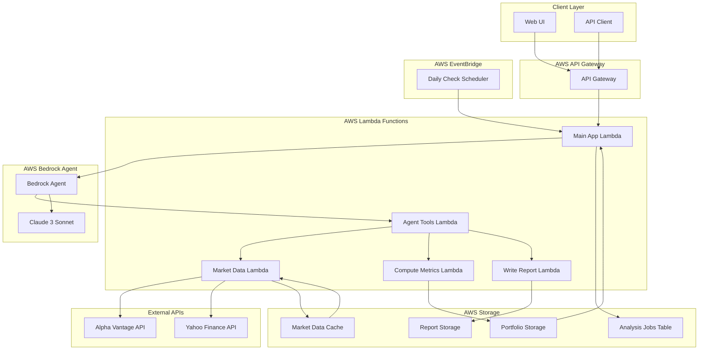

# FinMate - AI Portfolio Advisor

<div align="center">
  
  
  > **An AWS-native, reasoning-first personal finance agent** that analyzes stock portfolios, explains risks, and proposes actionable rebalancing suggestions. Built for the AWS AI Agent Global Hackathon.
  
  [](https://aws.amazon.com/bedrock/)
  [](https://www.typescriptlang.org/)
  [](https://aws.amazon.com/cdk/)
  [](LICENSE)
</div>

## 🏆 Hackathon Requirements Met

✅ **Real Bedrock Agent**: Actual AWS Bedrock Agent resource (visible in AWS Console)  
✅ **AgentCore Primitives**: Agent autonomously orchestrates tool calls  
✅ **Reasoning LLM**: Claude 3 Sonnet for decision-making  
✅ **Autonomous Capabilities**: EventBridge daily checks + agent tool orchestration  
✅ **External Integrations**: Alpha Vantage API, S3 storage, Lambda tools  
✅ **Complete Infrastructure**: CDK-deployed serverless architecture  
✅ **Web Interface**: Modern responsive UI with real-time analysis  
✅ **Professional Reports**: HTML reports with interactive charts  

**Agent ID**: Available in CloudFormation outputs after deployment  
**Verify**: Go to AWS Console → Bedrock → Agents to see the deployed agent

## 🚀 Quick Start

### Prerequisites

- Node.js 18+ and npm
- AWS CLI configured with appropriate permissions
- Alpha Vantage API key (free tier available)

### 1. Install Dependencies

```bash
npm install
cd lambda && npm install && cd ..
```

### 2. Set Environment Variables

```bash
export ALPHA_VANTAGE_API_KEY="your_api_key_here"
export CDK_DEFAULT_ACCOUNT="your_aws_account_id"
export CDK_DEFAULT_REGION="us-east-1"
```

### 3. Deploy Infrastructure

```bash
npm run build
npm run deploy
```

### 4. Test the Application

1. Open the web UI at the provided API Gateway URL
2. Upload the sample portfolio: `sample-portfolio.csv`
3. Click "Analyze Portfolio" to see AI-powered recommendations

## 🏗️ Architecture



### Core Components

- **Amazon Bedrock Agent**: Real AWS agent resource with autonomous tool orchestration
- **Claude 3 Sonnet**: Foundation model for reasoning and decision-making
- **Agent Tools Lambda**: Orchestrates tool calls from Bedrock Agent
- **Market Data Lambda**: Fetches real-time stock data (Python with yfinance)
- **Compute Metrics Lambda**: Calculates portfolio analytics and risk metrics
- **Write Report Lambda**: Generates professional HTML reports
- **Amazon S3**: Portfolio storage, market data cache, and report generation
- **DynamoDB**: Analysis job tracking and status management
- **API Gateway**: RESTful API endpoints with CORS support
- **EventBridge**: Scheduled daily portfolio checks
- **CloudFront**: Web hosting and CDN

### Agent Architecture

The Bedrock Agent autonomously:
1. **Receives** portfolio analysis request via main app Lambda
2. **Decides** which tools to call based on the request context
3. **Orchestrates** tool execution through Agent Tools Lambda
4. **Analyzes** results using Claude 3 Sonnet reasoning
5. **Returns** structured recommendations with rationale
6. **Generates** professional reports with actionable insights

## 📊 Features

### MVP Capabilities

- ✅ **Portfolio Upload**: CSV or JSON format
- ✅ **Market Data Integration**: Real-time quotes via Alpha Vantage
- ✅ **AI Analysis**: Risk assessment and recommendations
- ✅ **Report Generation**: HTML/Markdown reports with charts
- ✅ **Autonomous Operation**: Daily scheduled portfolio checks
- ✅ **Web Interface**: Modern, responsive UI

### AI-Powered Insights

- Portfolio diversification analysis
- Sector exposure calculations
- Risk flag identification
- Position sizing recommendations
- Beta-weighted portfolio analysis

## 🔧 API Endpoints

| Method | Endpoint | Description |
|--------|----------|-------------|
| POST | `/portfolio` | Upload portfolio (CSV/JSON) |
| GET | `/portfolio?portfolio_id=X` | Retrieve portfolio |
| POST | `/portfolio/analyze` | Analyze portfolio with AI |
| GET | `/report?user_id=X` | Get latest report |
| POST | `/simulate/rebalance` | Simulate rebalancing |

## 📁 Project Structure

```
├── bin/
│   └── finmate-app.ts          # CDK app entry point
├── lib/
│   └── finmate-stack.ts        # Infrastructure with Bedrock Agent
├── lambda/
│   ├── app.ts                  # Main Lambda (invokes Bedrock Agent)
│   ├── agent-tools.ts          # Agent tool orchestrator
│   ├── market-data-python.py  # Market data tool (Python)
│   ├── compute-metrics.ts      # Portfolio calculations tool
│   ├── write-report.ts         # Report generation tool
│   ├── rate-limiter.ts         # Bedrock rate limiting
│   └── package.json            # Lambda dependencies
├── lambda-layer/
│   └── python/                 # Python dependencies (yfinance, pandas, etc.)
├── web/
│   ├── index.html              # Web UI
│   ├── script.js               # Frontend JavaScript
│   └── styles.css              # CSS styling
├── logo.svg                    # FinMate logo
├── logo-icon.svg               # Square icon version
├── logo-png-generator.html     # PNG logo generator
├── sample-portfolio.csv        # Sample portfolio data
├── prd.md                      # Product requirements
├── architecture.md             # System architecture
├── demo.md                     # Demo guide
└── DEPLOYMENT_GUIDE.md         # Deployment instructions
```

## 🛠️ Development

### Local Testing

```bash
# Install AWS SAM CLI for local testing
npm install -g @aws-cdk/aws-lambda-nodejs
npm run build
```

### Verifying Bedrock Agent

After deployment, verify the agent is working:

1. **Check CloudFormation Outputs:**
   ```bash
   aws cloudformation describe-stacks --stack-name FinMateStack --query 'Stacks[0].Outputs'
   ```
   Look for `BedrockAgentId` and `BedrockAgentAliasId`

2. **View in AWS Console:**
   - Go to AWS Console → Amazon Bedrock → Agents
   - You should see `finmate-portfolio-advisor` agent
   - Status should be "Prepared"

3. **Test Agent Directly:**
   ```bash
   aws bedrock-agent-runtime invoke-agent \
     --agent-id YOUR_AGENT_ID \
     --agent-alias-id YOUR_AGENT_ALIAS_ID \
     --session-id test-123 \
     --input-text "Analyze a portfolio with AAPL" \
     --region us-east-1 \
     response.txt
   ```

4. **Check CloudWatch Logs:**
   - Agent traces show autonomous tool orchestration
   - Look for logs in `/aws/lambda/FinMateStack-AgentToolsFunction*`

### Adding New Tools

1. Add tool definition to `actionGroupSchema` in `lib/finmate-stack.ts`
2. Add routing logic to `lambda/agent-tools.ts`
3. Create new Lambda function for the tool
4. Agent will automatically discover and use the new tool

## 🔐 Security & Compliance

- **Data Encryption**: S3 server-side encryption
- **IAM Roles**: Least-privilege access
- **API Security**: API Gateway with CORS
- **Disclaimer**: All outputs include financial advice disclaimer

## 💰 Cost Optimization

- **Lambda**: Pay-per-request pricing
- **Bedrock**: Token-based pricing (optimized prompts)
- **S3**: Minimal storage costs
- **API Gateway**: Request-based pricing

Estimated monthly cost for MVP: < $50

## 🚨 Limitations (MVP)

- No live trading execution
- Limited to 100 tickers per analysis
- Basic risk models (no Monte Carlo)
- Single currency (USD) support
- Demo data only (no PII handling)

## 🔮 Future Enhancements

- Brokerage integration (Alpaca paper trading)
- Advanced risk models (VaR, Monte Carlo)
- Multi-currency support
- Tax optimization
- Real-time alerts and notifications
- Mobile app

## 📝 Sample Usage

### 1. Upload Portfolio

```bash
curl -X POST https://your-api-url/portfolio \
  -H "Content-Type: multipart/form-data" \
  -F "file=@sample-portfolio.csv"
```

### 2. Analyze Portfolio

```bash
curl -X POST https://your-api-url/portfolio/analyze \
  -H "Content-Type: application/json" \
  -d '{"portfolio_id": "your-portfolio-id", "risk_prefs": {"risk": "medium"}}'
```

### 3. Get Report

```bash
curl https://your-api-url/report?user_id=demo-user
```

## 🤝 Contributing

This is a hackathon project. For production use, consider:

- Enhanced error handling
- Input validation
- Rate limiting
- Monitoring and logging
- Security hardening

## 📄 License

MIT License - See LICENSE file for details

## ⚠️ Disclaimer

**This is not financial advice.** All recommendations are for educational purposes only. Please consult with a qualified financial advisor before making investment decisions.

---

Built with ❤️ for the AWS AI Agent Global Hackathon
