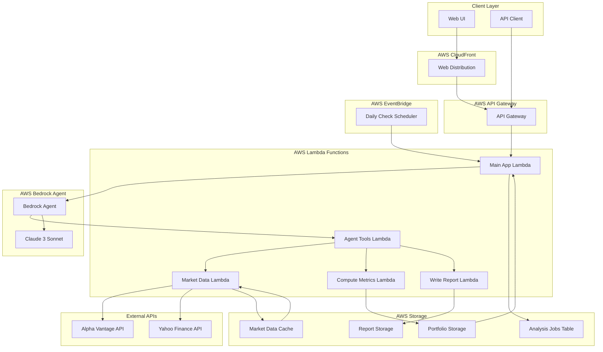

# FinMate Architecture

## System Overview

**FinMate** is a complete serverless AI portfolio advisor built on AWS with a **real Bedrock Agent** that autonomously orchestrates tool calls via AgentCore primitives. The agent is visible in AWS Console under Bedrock → Agents.



## Data Flow

### 1. Portfolio Upload & Analysis
```
User → Web UI → CloudFront → API Gateway → Main App Lambda
                                                    ↓
                                            Save to S3 (Portfolio Storage)
                                                    ↓
                                            Create Analysis Job (DynamoDB)
                                                    ↓
                                            Invoke Bedrock Agent
                                                    ↓
                                    ┌───────────────┴───────────────┐
                                    ↓                               ↓
                            Agent Tools Lambda              Claude 3 Sonnet
                                    ↓
                        ┌───────────┼───────────┐
                        ↓           ↓           ↓
                Market Data    Compute      Write Report
                Lambda         Metrics      Lambda
                        ↓           ↓           ↓
                Alpha Vantage   S3 Data    S3 Reports
                Yahoo Finance
                        ↓
                S3 Cache (15min TTL)
                                                    ↓
                                            Update Job Status
                                                    ↓
                                            Return Results
```

### 2. Autonomous Daily Check
```
EventBridge Scheduler (Daily 9 AM UTC) → Main App Lambda
                                                    ↓
                                            Load portfolios from S3
                                                    ↓
                                            Invoke Bedrock Agent
                                                    ↓
                                    ┌───────────────┴───────────────┐
                                    ↓                               ↓
                            Agent Tools Lambda              Claude 3 Sonnet
                                    ↓
                        ┌───────────┼───────────┐
                        ↓           ↓           ↓
                Market Data    Compute      Write Report
                Lambda         Metrics      Lambda
                        ↓           ↓           ↓
                Cached Data    Portfolio   Daily Summary
                (if available) Analysis    Report
                                                    ↓
                                            Store in S3
                                                    ↓
                                            Update Job Status
```

## Component Details

### AWS Services Used

| Service | Purpose | Configuration |
|---------|---------|---------------|
| **API Gateway** | REST API endpoints | CORS enabled, Lambda integration |
| **Lambda** | Serverless compute | Node.js 18 + Python 3.11, 5-15 min timeout |
| **Bedrock Agent** | AI agent orchestration | Claude 3 Sonnet, AgentCore primitives |
| **S3** | File storage | SSE-S3 encryption, versioned, lifecycle policies |
| **DynamoDB** | Job tracking | Pay-per-request, 7-day TTL |
| **EventBridge** | Scheduling | Daily cron at 9 AM UTC |
| **CloudFront** | Web hosting | S3 origin, HTTPS redirect, caching |
| **IAM** | Access control | Least-privilege roles, service principals |

### Lambda Functions

#### Main App Lambda (`app.ts`)
- **Purpose**: Orchestrates the entire analysis workflow
- **Triggers**: API Gateway, EventBridge
- **Actions**: 
  - Portfolio upload/retrieval
  - Invokes Bedrock Agent for analysis
  - Manages async job processing
  - Returns formatted results
- **Runtime**: Node.js 18.x, 15-minute timeout

#### Agent Tools Lambda (`agent-tools.ts`)
- **Purpose**: Routes Bedrock Agent tool calls to specific functions
- **Triggers**: Bedrock Agent via Action Group
- **Actions**:
  - Routes to market data, metrics, or report functions
  - Handles agent parameter parsing
  - Returns structured responses
- **Runtime**: Node.js 18.x, 5-minute timeout

#### Market Data Lambda (`market-data-python.py`)
- **Purpose**: Fetches real-time market data
- **External APIs**: Alpha Vantage + Yahoo Finance
- **Features**: 
  - Rate limiting (5 calls/minute)
  - S3 caching (15-minute TTL)
  - Endpoint rotation and retry logic
  - User-Agent rotation
- **Runtime**: Python 3.11, 30-second timeout

#### Compute Metrics Lambda (`compute-metrics.ts`)
- **Purpose**: Calculates portfolio analytics
- **Calculations**:
  - Position weights and P&L
  - Sector exposure analysis
  - Risk flag identification
  - Portfolio beta calculation
- **Runtime**: Node.js 18.x, 5-minute timeout

#### Write Report Lambda (`write-report.ts`)
- **Purpose**: Generates formatted reports
- **Outputs**: HTML and Markdown formats
- **Features**:
  - Responsive design
  - Interactive charts
  - Pre-signed URLs for access
- **Runtime**: Node.js 18.x, 5-minute timeout

## Security & Compliance

### Data Protection
- **Encryption**: S3 server-side encryption (SSE-S3)
- **Access Control**: IAM roles with least privilege
- **API Security**: CORS configuration, input validation
- **No PII**: Demo data only, no personal information

### Cost Optimization
- **Lambda**: Pay-per-request pricing
- **Bedrock**: Optimized prompts to minimize tokens
- **S3**: Minimal storage with lifecycle policies
- **Caching**: Reduces external API calls

## Scalability Considerations

### Current Limitations (MVP)
- 100 tickers per analysis
- Single currency (USD)
- Basic error handling
- No user authentication

### Future Enhancements
- Horizontal scaling with Lambda concurrency
- Multi-currency support
- Advanced caching strategies
- User management and authentication
- Real-time streaming updates

## Monitoring & Observability

### Logging
- CloudWatch Logs for all Lambda functions
- Structured logging with correlation IDs
- Error tracking and alerting

### Metrics
- API Gateway request/response metrics
- Lambda duration and error rates
- S3 storage and request metrics
- Bedrock token usage and costs

## Deployment Architecture

### Infrastructure as Code
- **CDK**: TypeScript-based infrastructure
- **Stack**: Single stack with all resources
- **Environment**: Development/Production separation
- **CI/CD**: Manual deployment via scripts

### Environment Variables
```bash
ALPHA_VANTAGE_API_KEY=your_api_key
BUCKET_NAME=finmate-portfolios-account-region
MARKET_DATA_FUNCTION=function_name
COMPUTE_METRICS_FUNCTION=function_name
WRITE_REPORT_FUNCTION=function_name
```

## API Design

### RESTful Endpoints
```
POST /portfolio              # Upload portfolio
GET  /portfolio?id=X         # Get portfolio
POST /portfolio/analyze      # Analyze portfolio
GET  /report?user_id=X       # Get latest report
POST /simulate/rebalance     # Simulate rebalancing
```

### Request/Response Formats
- **Upload**: Multipart form data (CSV) or JSON
- **Analysis**: JSON with portfolio_id and risk preferences
- **Response**: JSON with summary, recommendations, and report URL

## Error Handling Strategy

### Graceful Degradation
- Market data failures → Use cached data or defaults
- AI analysis failures → Return basic metrics
- Report generation failures → Return JSON summary
- Network timeouts → Retry with exponential backoff

### User Experience
- Clear error messages
- Fallback recommendations
- Progress indicators
- Retry mechanisms
